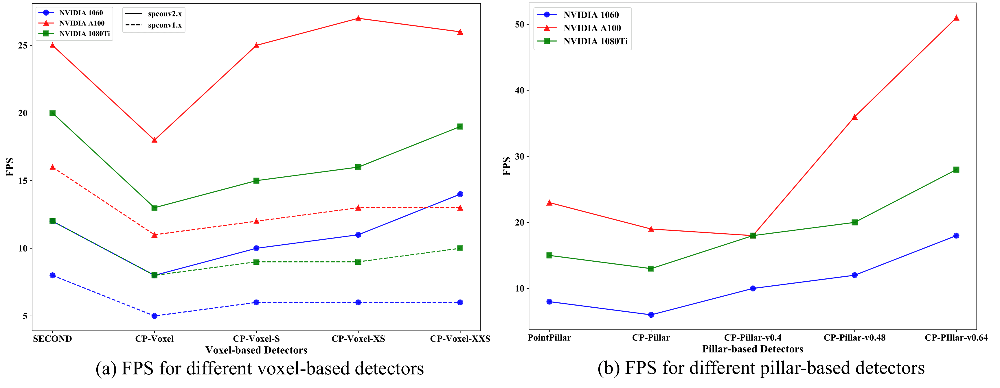

# Towards Efficient 3D Object Detection with Knowledge Distillation

---
[Jihan Yang](https://jihanyang.github.io/), [Shaoshuai Shi](https://shishaoshuai.com/), [Runyu Ding](https://github.com/Dingry), [Zhe Wang](https://wang-zhe.me/), [Xiaojuan Qi](https://xjqi.github.io/)

This repository contains the official implementation of [Towards Efficient 3D Object Detection with Knowledge Distillation](https://openreview.net/pdf?id=1tnVNogPUz9), NeurIPS 2022


## Changelog
[2022-09-] Code release for Waymo results.

## Introduction
Our code is based on [OpenPCDet v0.5.2](https://github.com/open-mmlab/OpenPCDet/tree/v0.5.2).
More updates on OpenPCDet are supposed to be compatible with our code.

## Model Zoo
### Waymo Open Dataset
#### Basic Models without KD
Similar to OpenPCDet, all models in the following table are trained with a single frame of 20% data (~32k frames) of all 
the training samples on 8 GTX 1080Ti GPUs. 
Note that the validation are also carried on the 20% validation set with `DATA_CONFIG.SAMPLED_INTERVAL.test 5` 
(similar performance with 100% validation set).

|                             Model (20% data)                              | LEVEL2 mAPH | Flops (G) | Acts (M) | Latency (ms) |
|:-------------------------------------------------------------------------:|:-----------:|:---------:|:--------:|:------------:|
|        [CP-Voxel](tools/cfgs/waymo_models/cp-voxel/cp-voxel.yaml)         |    64.29    |   114.8   |  101.9   |    125.70    |
|      [CP-Voxel-S](tools/cfgs/waymo_models/cp-voxel/cp-voxel-s.yaml)       |    62.23    |   47.8    |   65.7   |    97.99     |
|     [CP-Voxel-XS](tools/cfgs/waymo_models/cp-voxel/cp-voxel-xs.yaml)      |    61.14    |   36.9    |   58.4   |    88.19     |
|    [CP-Voxel-XXS](tools/cfgs/waymo_models/cp-voxel/cp-voxel-xxs.yaml)     |    56.26    |   12.0    |   33.1   |    70.44     |
|       [CP-Pillar](tools/cfgs/waymo_models/cp-pillar/cp-pillar.yaml)       |    59.09    |   333.9   |  303.0   |    157.90    |
|  [CP-Pillar-v0.4](tools/cfgs/waymo_models/cp-pillar/cp-pillar-v0.4.yaml)  |    57.55    |   212.9   |  197.7   |    103.37    |
| [CP-Pillar-v0.48](tools/cfgs/waymo_models/cp-pillar/cp-pillar-v0.48.yaml) |    56.27    |   149.4   |  142.3   |    81.87     |
| [CP-Pillar-v0.64](tools/cfgs/waymo_models/cp-pillar/cp-pillar-v0.64.yaml) |    52.81    |   85.1    |   88.0   |    54.52     |


#### Sparse Distillation Models 
|                                       Model (20% data)                                        | LEVEL2 mAPH | Gains |
|:---------------------------------------------------------------------------------------------:|:-----------:|:-----:|
|      [CP-Voxel-S + SparseKD](tools/cfgs/waymo_models/cp-voxel/cp-voxel-s_sparsekd.yaml)       |    64.25    | +2.0  |
|     [CP-Voxel-XS + SparseKD](tools/cfgs/waymo_models/cp-voxel/cp-voxel-xs_sparsekd.yaml)      |    63.53    | +2.4  |
|    [CP-Voxel-XXS + SparseKD](tools/cfgs/waymo_models/cp-voxel/cp-voxel-xxs_sparsekd.yaml)     |    59.28    | +3.0  |
|  [CP-Pillar-v0.4 + SparseKD](tools/cfgs/waymo_models/cp-pillar/cp-pillar-v0.4_sparsekd.yaml)  |    59.24    | +1.7  |
| [CP-Pillar-v0.48 + SparseKD](tools/cfgs/waymo_models/cp-pillar/cp-pillar-v0.48_sparsekd.yaml) |    58.53    | +2.3  |
| [CP-Pillar-v0.64 + SparseKD](tools/cfgs/waymo_models/cp-pillar/cp-pillar-v0.64_sparsekd.yaml) |    55.82    | +3.0  |


Here we also provide the performance of several models trained on the full training set and validate on the 
full validation set.

|                                       Model (100% data)                                       | LEVEL2 mAPH | 
|:---------------------------------------------------------------------------------------------:|:-----------:|
|                  [CP-Voxel](tools/cfgs/waymo_models/cp-voxel/cp-voxel.yaml)                   |    65.58    | 
|                 [CP-Pillar](tools/cfgs/waymo_models/cp-pillar/cp-pillar.yaml)                 |    61.56    |
|               [PV-RCNN++](tools/cfgs/waymo_models/pv_rcnn_plusplus_resnet.yaml)               |    69.46    |
|      [CP-Voxel-S + SparseKD](tools/cfgs/waymo_models/cp-voxel/cp-voxel-s_sparsekd.yaml)       |    65.75    |
|     [CP-Voxel-XS + SparseKD](tools/cfgs/waymo_models/cp-voxel/cp-voxel-xs_sparsekd.yaml)      |    64.83    |
|    [CP-Voxel-XXS + SparseKD](tools/cfgs/waymo_models/cp-voxel/cp-voxel-xxs_sparsekd.yaml)     |    60.93    |
|  [CP-Pillar-v0.4 + SparseKD](tools/cfgs/waymo_models/cp-pillar/cp-pillar-v0.4_sparsekd.yaml)  |    61.60    |
| [CP-Pillar-v0.48 + SparseKD](tools/cfgs/waymo_models/cp-pillar/cp-pillar-v0.48_sparsekd.yaml) |    60.95    |
| [CP-Pillar-v0.64 + SparseKD](tools/cfgs/waymo_models/cp-pillar/cp-pillar-v0.64_sparsekd.yaml) |    58.89    |


#### Cross stage distillation
|                                     Model (20% data)                                      | LEVEL2 mAPH | Flops (G) | Acts (M) | Latency (ms) |
|:-----------------------------------------------------------------------------------------:|:-----------:|:---------:|:--------:|:------------:|
|             [PV-RCNN++](tools/cfgs/waymo_models/pv_rcnn_plusplus_resnet.yaml)             |    67.80    |   123.5   |  179.7   |    435.9     |
|                [CP-Voxel](tools/cfgs/waymo_models/cp-voxel/cp-voxel.yaml)                 |    64.29    |   114.8   |  101.9   |    125.7     |
| [CP-Voxel + SparseKd](tools/cfgs/waymo_models/cp-voxel/cp-voxel_sparsekd_crossstage.yaml) |    65.27    |   114.8   |  101.9   |    125.7     |


We could not publicly provide the above pretrained models due to [Waymo Dataset License Agreement](https://waymo.com/open/terms/).
To access these pretrained models, please email us your name, institute, a screenshot of the Waymo 
dataset registration confirmation mail, and your intended usage. Please send a second email if we don't get back to you 
in two days. Please note that Waymo open dataset is under strict non-commercial license, so we are not allowed to share 
the model with you if it will use for any profit-oriented activities.


### Latency on Different Hardware



Following results are measured in milliseconds.

|      Model      | 1060 + Spconv2.x | 1080Ti + Spconv2.x | A100 + Spconv2.x | 
|:---------------:|:----------------:|:------------------:|:----------------:|
|     SECOND      |      84.56       |       50.65        |      40.44       | 
|   PointPillar   |      129.12      |       68.61        |      44.14       | 
|    CP-Voxel     |      125.70      |       74.25        |      56.13       | 
|   CP-Voxel-S    |      97.99       |       65.68        |      39.40       |
|   CP-Voxel-XS   |      88.19       |       61.41        |      36.65       | 
|  CP-Voxel-XXS   |      70.44       |       53.86        |      38.01       |
|    CP-Pillar    |      157.90      |       77.29        |      51.94       | 
| CP-Pillar-v0.4  |      103.37      |       56.32        |      57.07       |
| CP-Pillar-v0.48 |      81.87       |       49.64        |      27.44       | 
| CP-Pillar-v0.64 |      54.52       |       36.23        |      19.56       |


## Installation

Please refer to [INSTALL.md](docs/INSTALL.md) for the installation of `OpenPCDet`.


## Getting Started

Please refer to [GETTING_STARTED.md](docs/GETTING_STARTED.md) to learn more usage about this project.


## License
`Our code` is released under the [Apache 2.0 license](LICENSE).

## Acknowledgement
Our code is heavily based on [OpenPCDet](https://github.com/open-mmlab/OpenPCDet). 
Thanks OpenPCDet Development Team for their awesome codebase.


## Citation 
If you find this project useful in your research, please consider cite:

```
@inproceedings{yang2022towards,
    title={Towards Efficient 3D Object Detection with Knowledge Distillation},
    author={Yang, Jihan and Shi, Shaoshuai and Ding, Runyu and Wang, Zhe and Qi, Xiaojuan},
    booktitle={Advances in neural information processing systems},
    year={2022}
}
```
```
@misc{openpcdet2020,
    title={OpenPCDet: An Open-source Toolbox for 3D Object Detection from Point Clouds},
    author={OpenPCDet Development Team},
    howpublished = {\url{https://github.com/open-mmlab/OpenPCDet}},
    year={2020}
}
```

